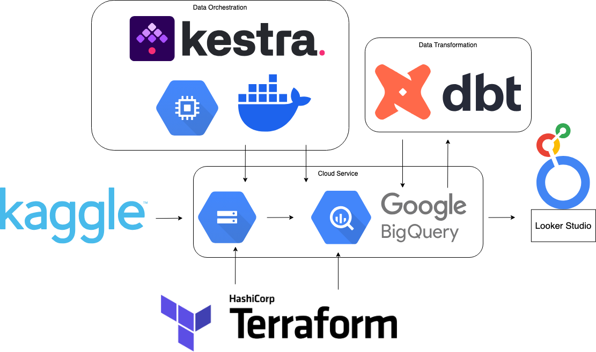
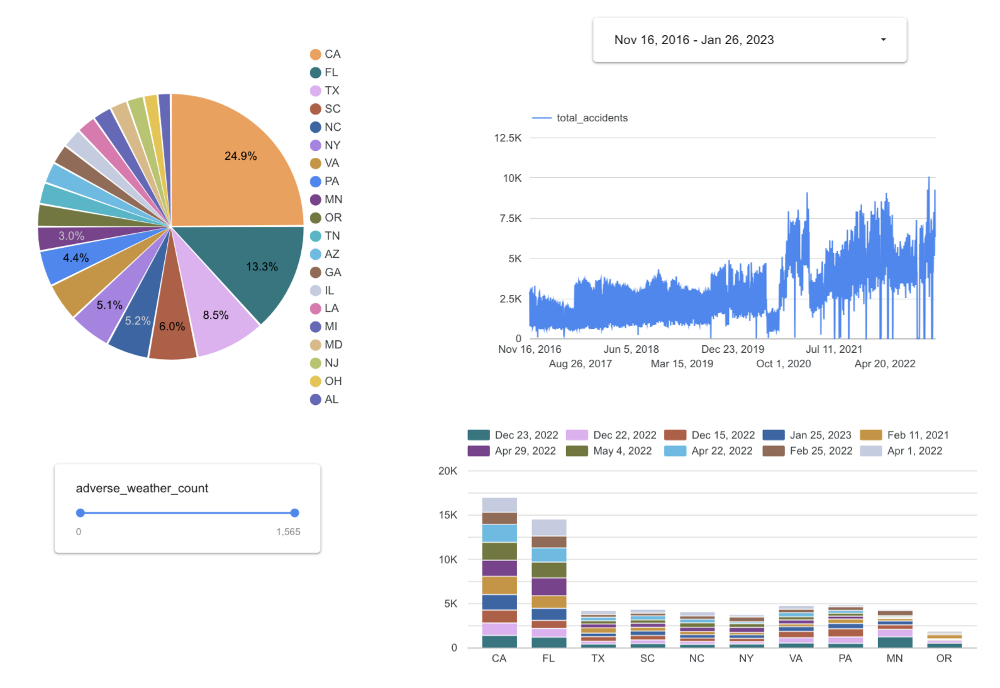

# U.S. Traffic Accidents Data Pipeline and Analytics

## Project Overview

This project implements an end-to-end data engineering pipeline to visualize a countrywide car accident dataset covering 49 U.S. states. The goal is to provide insights into the data and develop analytical tools through a pipeline and dashboard. The dataset currently contains approximately 7.7 million accident records, spanning from February 2016 to March 2023.

## Project Architecture




## Technologies
- Infrastructure as code (IaC): Terraform
- Batch / Workflow orchestration: Kestra
- Data Lake: Google Cloud Storage
- Data Warehouse: BigQuery
- Data transformation: dbt cloud
- Dashboard: Google Looker Studio
- Other GCP Services: Compute Engine, Docker
- Python 3.9

## 1. Problem Description

**Problem:** Car accidents are a significant public safety concern across the United States, affecting millions of lives and contributing to economic loss and infrastructure strain. However, the large-scale data generated from these incidents is often underutilized due to the challenges of accessing, processing, and visualizing it effectively.

Making this data accessible and analyzable through a well-structured dashboard empowers stakeholders—such as city planners, policymakers, researchers, and public safety officials—to identify patterns, uncover risk factors, and make informed decisions to improve road safety and infrastructure planning.

**Solution:** This project addresses the challenge of making large-scale car accident data usable by building an automated data pipeline that:
1.  **Ingests** car accident data spanning multiple years (2016–2023) across the U.S.
2.  **Stores** the raw data efficiently in cloud storage as a data lake.
3.  **Loads** the data into a structured data warehouse (BigQuery) for scalable querying.
4.  **Transforms**  the data for analytical use, focusing on key attributes such as location, time, weather conditions, and severity.
5.  **Visualizes** key metrics and trends through an interactive dashboard built with Looker Studio.

By automating the flow from ingestion to visualization, the project provides a comprehensive and accessible view of traffic incidents across the country, enabling easier exploration of accident patterns, risk factors, and regional trends to support data-driven decisions in public safety and infrastructure planning.


## Set up
### 1. Create a GCP service account and a key
The service account should have the following roles:
- BigQuery Admin
- Storage Admin
- Compute Admin


### 2. Terraform
Working directory is `terraform`.
We will create the following GCP resources:
- a GCS bucket for data lake 
- a BigQuery dataset for saving the raw data
- Please enable the following APIs: Cloud Storage API, BigQuery API, Compute Engine API

#### 2.1 Prerequisites:
*   [Install Terraform](https://learn.hashicorp.com/tutorials/terraform/install-cli). 
*   A GCP Service Account key file with permissions to manage GCS and BigQuery resources (e.g., roles like `Storage Admin`, `BigQuery Admin`).

#### 2.2 Navigate to Terraform Directory:
```bash
cd Terraform
```

#### 2.3 Update Variables:
*   Open the `variables.tf` file.
*   Update the `project` variable with your GCP Project ID.
*   Update the `gcs_bucket_name` to a globally unique name for your bucket.
*   Update the `bq_dataset_name` if desired.
*   Ensure the `credentials` variable points to the correct path of your downloaded GCP service account key file.

#### 2.4 Initialize Terraform:
*   Run the following command in the `Terraform` directory to initialize the backend and download the necessary provider plugins:
```bash
terraform init
```

#### 2.5 Plan Deployment:
*   Run the following command to preview the changes Terraform will make:
```bash
terraform plan
```

#### 2.6 Apply Changes:
*   If the plan looks correct, apply the changes to create the resources in your GCP project:
```bash
terraform apply
```
*   Type `yes` when prompted to confirm.

**Note:** If you choose not to use Terraform, you must create the GCS bucket and BigQuery dataset manually in your GCP project before proceeding with the Airflow setup. Ensure the names match those expected by the Airflow DAGs (or update the DAGs accordingly).

### 3. Configure Kestra with Docker
We will use Docker to run the Kestra server for data ingestion.

#### 3.1 Start Kestra in Docker
Working directory is the root directory.

Make sure Docker is installed, then start the Kestra services using:
```bash
docker compose up -d
```
This command launches the Kestra server, web UI, and executor in the background.

Once running, the Kestra UI is available at:
`http://localhost:8080`

#### 3.2 Configure Credentials for GCP and Kaggle
To authenticate your workflows with GCP:

Please place your service account key file (e.g., gcp-sa.json) in a known location and reference it in your workflow definition.
This credential can be mounted into the container or referenced using absolute file paths in your workflow YAML.

Example (in a task config):
```YML
tasks:
  - id: gcp_creds
    type: io.kestra.plugin.core.kv.Set
    key: GCP_CREDS
    kvType: JSON
    value: # your gcp-sa.json key
        


  - id: gcp_project_id
    type: io.kestra.plugin.core.kv.Set
    key: GCP_PROJECT_ID
    kvType: STRING
    value: # your project name

  - id: gcp_location
    type: io.kestra.plugin.core.kv.Set
    key: GCP_LOCATION
    kvType: STRING
    value: # gcp location

  - id: gcp_bucket_name
    type: io.kestra.plugin.core.kv.Set
    key: GCP_BUCKET_NAME
    kvType: STRING
    value: # your bucket name 
    
  - id: gcp_dataset
    type: io.kestra.plugin.core.kv.Set
    key: GCP_DATASET
    kvType: STRING
    value: # your dataset name
```

#### 3.3 Workflow Overview
Run the Kestra pipeline in kestra folder that performs the following steps:

1. Download data from Kaggle.
2. Upload the dataset to a Google Cloud Storage bucket.
3. Ingest the data into BigQuery:
    - Create a temporary table.
    - Merge the data into a main table using merging logic.

All of this is handled by Kestra workflows defined in YAML files under kestra directory.

#### 3.4 Running Workflows
You can trigger workflows in one of three ways:
* Via the Kestra UI at http://localhost:8080
* Using the CLI (if installed separately)
* Automatically via a schedule defined in the YAML

To run a workflow in the UI:
1. Navigate to the workflow in your current project namespace
2. Create a new workflow and past the yml content
3. Click Run


To schedule it, we need to add a Schedule trigger:
```YML
triggers:
  - id: daily-scheduler
    type: io.kestra.core.models.triggers.types.Schedule
    cron: "0 5 * * *"
```

### 4. Data Transformation with dbt Cloud
We will use dbt (Data Build Tool) to transform the raw accident data ingested into BigQuery into clean, analysis-ready tables. The dbt project is organized in this repo under the dbt/ directory, following the standard layered structure for maintainable and scalable data modeling.

#### 4.1 Staging Layer (models/staging/)
* Pulls raw data from the BigQuery source table
* Renames and standardizes column names
* Includes schema definitions and tests (schema.yml).

#### 4.2 Intermediate Layer (models/core/)
* Casts and cleans column data types (e.g., timestamps, numerics)
* Materialized as a partitioned and clustered table on:
  - accident_date (partition)
  - state, city (cluster)

#### 4.2 Analytical Layer (models/core/)
* Aggregates accident data by state and accident_date
* Computes key metrics:
  - total_accidents
  - average severity
  - adverse_weather_count
  - Materialized as a table

### 5. Dashboard Visualization with Looker Studio
After transforming and aggregating the car accident data using dbt and BigQuery, we visualize the results in an interactive dashboard built with Looker Studio.

The dashboard visualizes the transformed data. It includes at least two tiles:
* One shows distribution across a category (e.g., spend by state).
* One shows trends over time (e.g., count of accidents per year and month).

