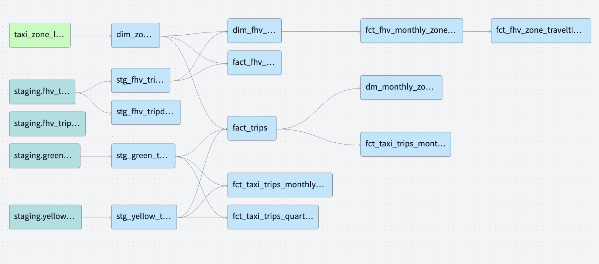

# Datasets list

* Yellow taxi data - Years 2019 and 2020
* Green taxi data - Years 2019 and 2020
* fhv data - Year 2019.

**Data extraction and loading are handled by Kestra**

Then, use `dbt` to transfrom the tables, generating the following lineage:

