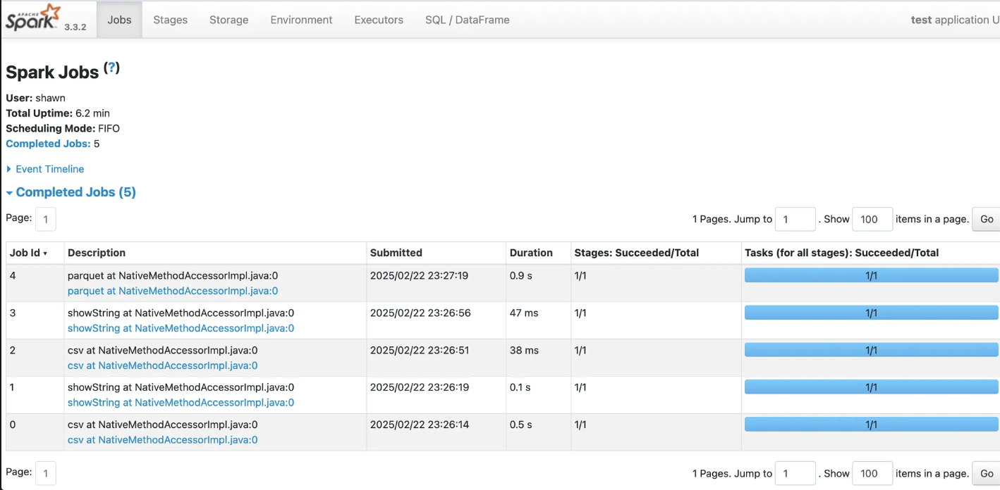

# install pyspark

### 1. install jdk

- download package `wget https://download.java.net/java/GA/jdk11/9/GPL/openjdk-11.0.2_linux-x64_bin.tar.gz`
- unzip the package `tar xzvf penjdk-11.0.2_linux-x64_bin.tar.gz`
- remove zip file `rm openjdk-11.0.2_linux-x64_bin.tar.gz`
- define `JAVA_HOME` and add it to `PATH`:
    
    ```bash
    export JAVA_HOME="${HOME}/spark/jdk-11.0.2"
    export PATH="${JAVA_HOME}/bin:${PATH}"
    ```
    

check that it works:

```
java --version
```

Output:

```bash
openjdk 11.0.2 2019-01-15
OpenJDK Runtime Environment 18.9 (build 11.0.2+9)
OpenJDK 64-Bit Server VM 18.9 (build 11.0.2+9, mixed mode)
```

check installation `which java`

### 2. install spark

- run `wget https://archive.apache.org/dist/spark/spark-3.3.2/spark-3.3.2-bin-hadoop3.tgz`

Unpack:

```
tar xzfv spark-3.3.2-bin-hadoop3.tgz
```

Remove the archive:

```
rm spark-3.3.2-bin-hadoop3.tgz
```

Add it to `PATH`:

```
export SPARK_HOME="${HOME}/spark/spark-3.3.2-bin-hadoop3"
export PATH="${SPARK_HOME}/bin:${PATH}"
```

**Testing Spark**

Execute `spark-shell` and run the following:

```bash
val data = 1 to 10000
val distData = sc.parallelize(data)
distData.filter(_ < 10).collect()
```

### 3. put java variable to bashrc

- run `nano .bashrc` from home dir
- add variable from java section to the end of file
- control + o to save file, enter to confirm
- control + x to exit
- `source .bashrc` to execute the effect
- to check if set up correct

```bash
which java
which pyspark
```

### Check Completion Status 
